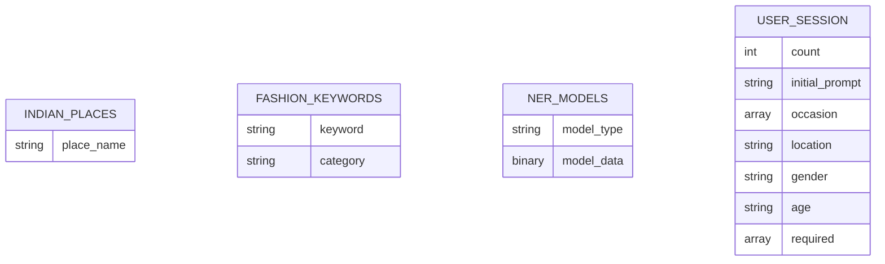
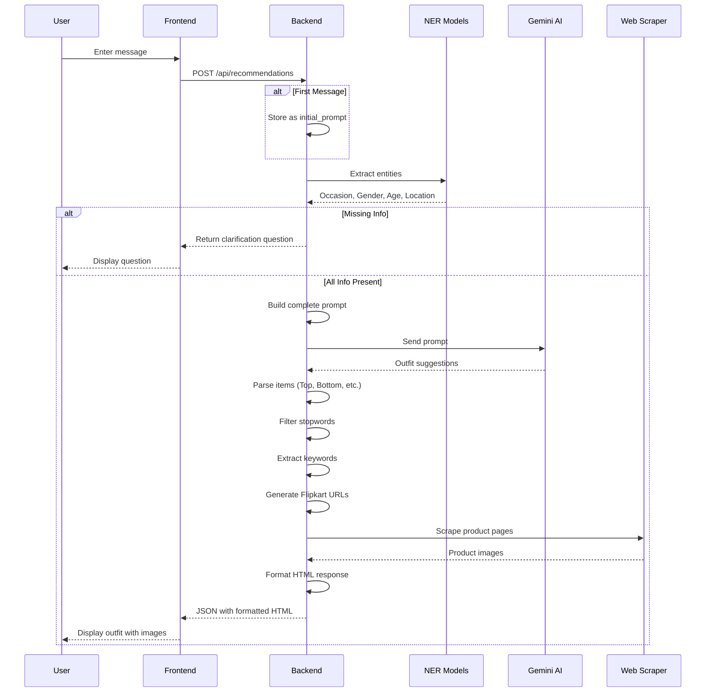
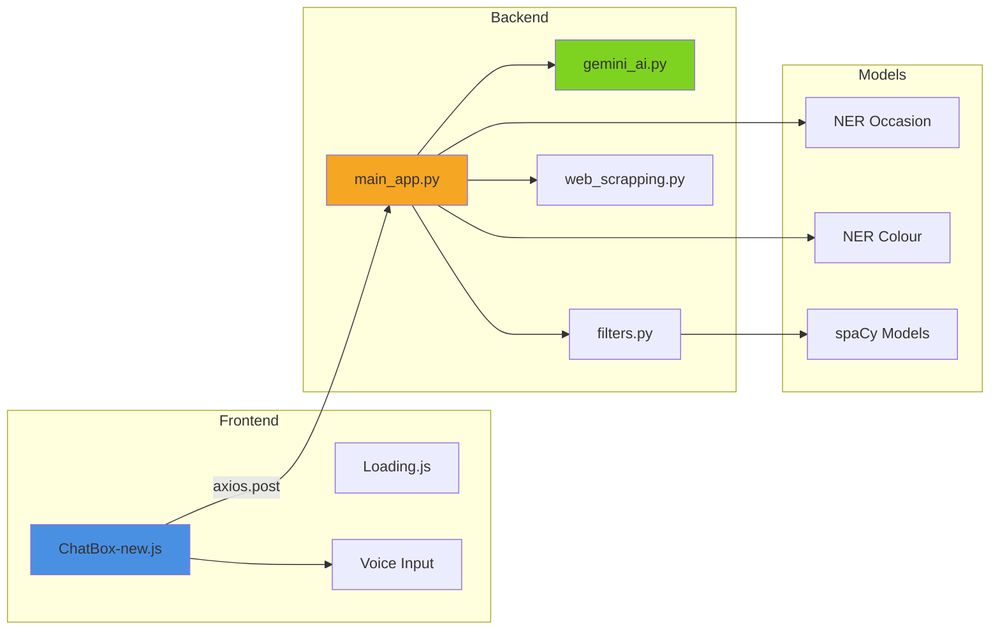
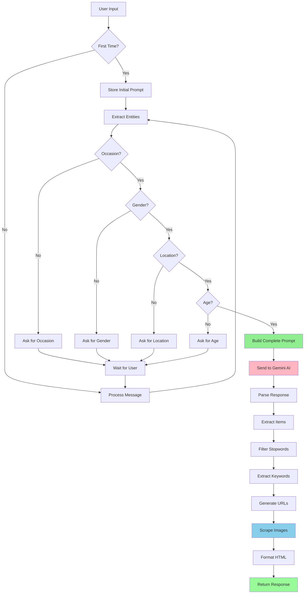
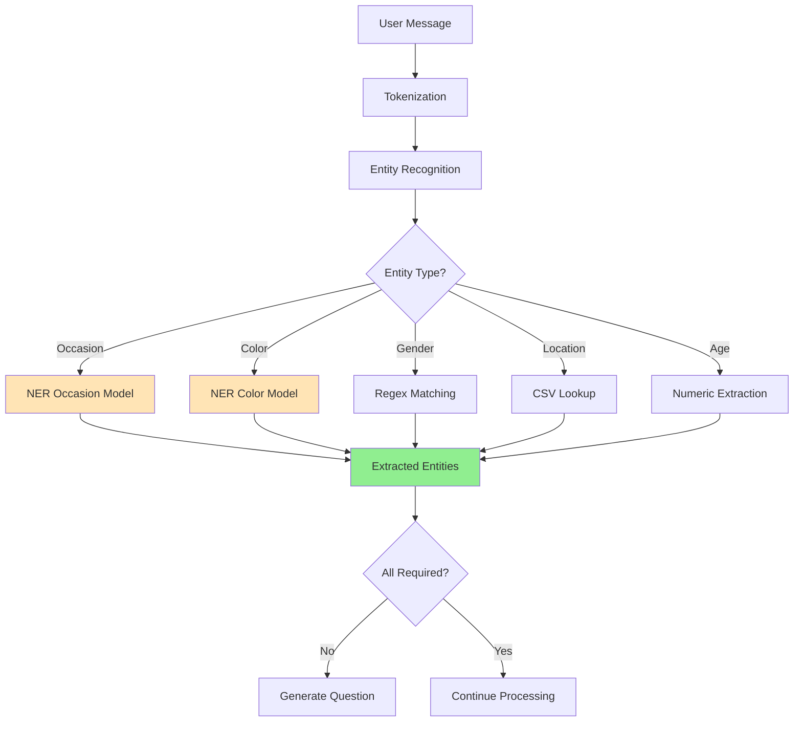
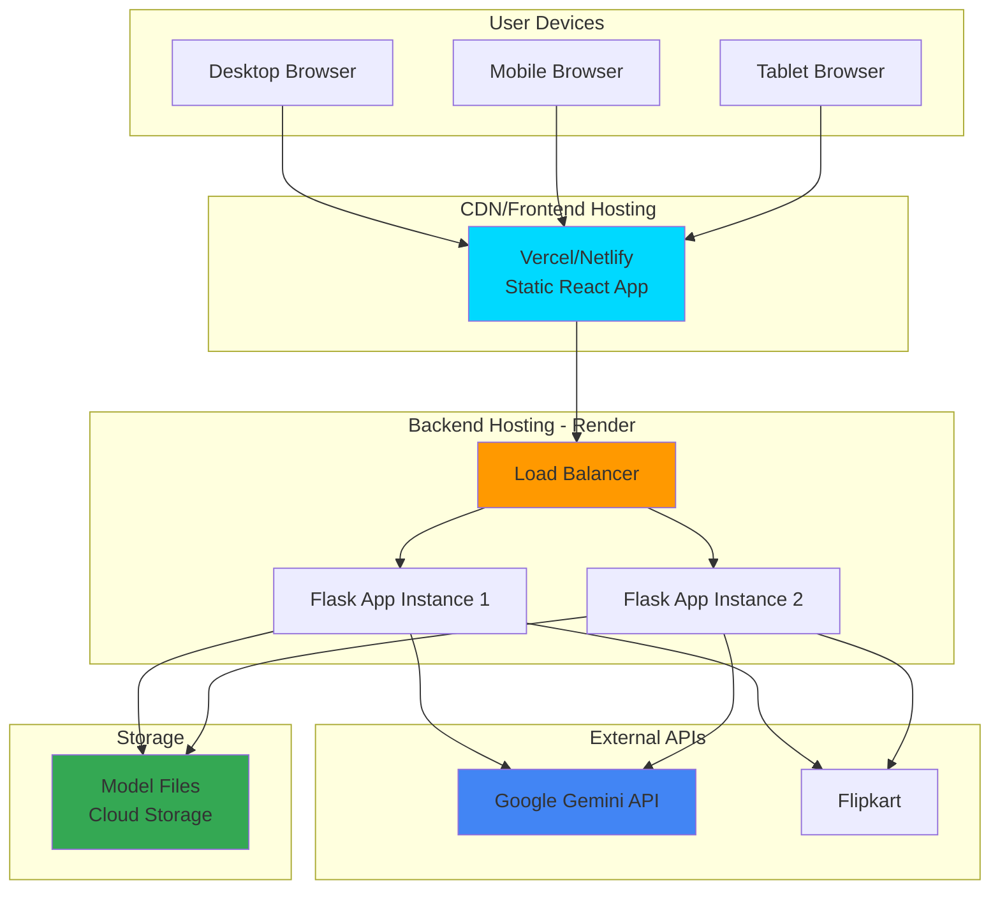
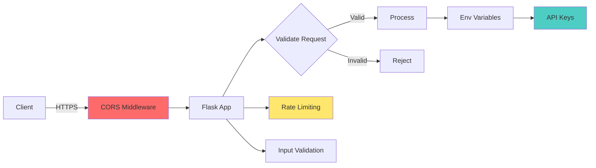
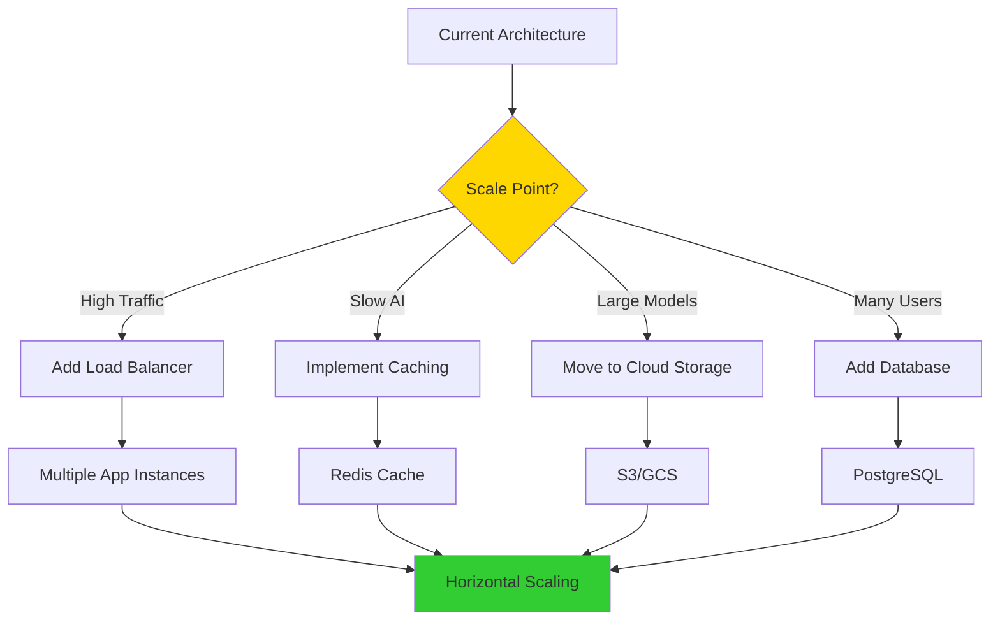

# Application Architecture Diagram

## 🏗️ System Architecture Overview

```mermaid
graph TB
    subgraph "Client Layer"
        A[React Frontend<br/>Port: 3000]
        A1[ChatBox Component]
        A2[Voice Recognition]
        A3[Message Display]
    end
    
    subgraph "API Layer"
        B[Flask Backend<br/>Port: 5000/10000]
        B1[/api/recommendations]
    end
    
    subgraph "Processing Layer"
        C1[Entity Extraction]
        C2[NLP Processing]
        C3[Prompt Builder]
    end
    
    subgraph "AI/ML Layer"
        D1[spaCy NER Models]
        D2[Google Gemini API]
        D3[Keyword Extraction]
    end
    
    subgraph "Data Layer"
        E1[(indian_places.csv)]
        E2[(fashion_keywords.txt)]
        E3[(NER Models)]
    end
    
    subgraph "External Services"
        F1[Flipkart API]
        F2[Web Scraping]
    end
    
    A --> A1
    A --> A2
    A --> A3
    A1 -->|HTTP POST| B
    B --> B1
    B1 --> C1
    C1 --> C2
    C2 --> C3
    
    C1 --> D1
    C3 --> D2
    C2 --> D3
    
    D1 --> E3
    C1 --> E1
    D3 --> E2
    
    C3 --> F1
    F1 --> F2
    
    F2 -->|Images| B
    B -->|JSON Response| A
    
    style A fill:#e1f5ff
    style B fill:#fff4e1
    style D2 fill:#ffe1f5
    style F2 fill:#e1ffe1
```

## 📊 Database Schema (Current: File-Based)



## 🔄 Request-Response Flow



## 🧩 Component Interaction



## 📁 File Structure Visualization

```
conversational-fashion-outfit-generator/
│
├── 📱 CLIENT (React Frontend)
│   ├── src/
│   │   ├── App.js ───────────────► Root Component
│   │   ├── components/
│   │   │   ├── Chatbox-new.js ──► Main Chat Interface
│   │   │   ├── Loading.js ──────► Loading Animation
│   │   │   └── ChatBox.css ─────► Styles
│   │   └── index.js ────────────► Entry Point
│   └── package.json ────────────► Dependencies
│
├── 🖥️ SERVER (Flask Backend)
│   ├── main_app.py ─────────────► Main Application
│   │   ├── Flask Setup
│   │   ├── check_prompt() ─────► Entity Extraction
│   │   ├── get_answer_bard() ──► AI Response
│   │   └── API Endpoints
│   │
│   ├── gemini_ai.py ────────────► AI Configuration
│   ├── filters.py ──────────────► Keyword Processing
│   ├── web_scrapping.py ────────► Product Scraping
│   │
│   ├── 📊 data/
│   │   ├── indian_places.csv ──► Location Data
│   │   ├── fashion_keywords.txt► Keywords
│   │   └── fashion_data.csv ───► Fashion Data
│   │
│   └── 🤖 models/
│       ├── ner_model_occasion/ ► Occasion NER
│       ├── ner_model_colour/ ──► Color NER
│       ├── trained_model.pkl ──► ML Model
│       └── vectorizer.pkl ─────► Feature Vectorizer
│
└── 📚 Documentation
    ├── README.md
    ├── DEPLOYMENT_GUIDE.md
    └── RENDER_DEPLOYMENT.md
```

## 🔄 Data Flow Diagram



## 🧠 NLP Processing Pipeline



## 🌐 Deployment Architecture (Production)



## 🔐 Security Architecture



## 📊 Performance Metrics

### Response Time Breakdown

```
Total Request Time (avg): 3-5 seconds
│
├─ Frontend Processing: 50-100ms
│  ├─ User Input: 10ms
│  ├─ Validation: 20ms
│  └─ Rendering: 20-50ms
│
├─ Network Latency: 100-300ms
│  ├─ Request: 50-150ms
│  └─ Response: 50-150ms
│
└─ Backend Processing: 2.5-4.5s
   ├─ Entity Extraction: 200-500ms
   │  ├─ NER Models: 150-300ms
   │  └─ Regex/CSV: 50-200ms
   │
   ├─ AI Generation: 1-2s
   │  └─ Gemini API: 1-2s
   │
   └─ Product Scraping: 1-2s
      ├─ URL Generation: 100ms
      ├─ Web Requests: 500-1000ms
      └─ Image Extraction: 400-900ms
```

## 🎯 Scalability Considerations



---

*This architecture supports the current implementation and provides clear paths for future scaling and enhancements.*
