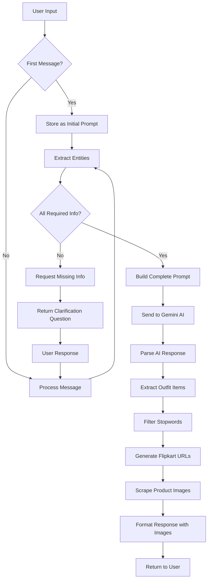

# Conversational Fashion Outfit Generator

## 📋 Table of Contents
- [Overview](#overview)
- [Features](#features)
- [Architecture](#architecture)
- [Technology Stack](#technology-stack)
- [Project Structure](#project-structure)
- [How It Works](#how-it-works)
- [API Flow](#api-flow)
- [Setup Instructions](#setup-instructions)
- [Deployment](#deployment)
- [Known Issues & Solutions](#known-issues--solutions)

---

## 🎯 Overview

The **Conversational Fashion Outfit Generator** is an AI-powered chatbot application that provides personalized fashion recommendations based on user preferences. Users can have natural conversations with the bot to receive outfit suggestions tailored to specific occasions, locations, age groups, and personal style preferences.

The application leverages:
- **Google Gemini AI** for natural language understanding and outfit generation
- **Custom NER (Named Entity Recognition)** models for extracting fashion-specific entities
- **Web scraping** to fetch product images from Flipkart
- **Real-time conversational interface** with voice input support

---

## ✨ Features

### Core Features
1. **Conversational Interface**: Natural language chat interface for seamless user interaction
2. **Voice Input**: Speech-to-text support for hands-free interaction
3. **Personalized Recommendations**: Context-aware outfit suggestions based on:
   - Occasion (casual, formal, party, traditional)
   - Location (with support for Indian cities)
   - Gender and Age
   - Color preferences
4. **Product Integration**: Real-time product image fetching from Flipkart
5. **Multi-turn Conversations**: Maintains context across conversation turns
6. **AI-Powered**: Uses Google Gemini AI for intelligent outfit generation

### User Experience
- Clean, modern chat interface
- Real-time loading indicators
- Image previews of suggested items
- Sample prompts for easy start
- New conversation management

---

## 🏗️ Architecture

### High-Level Architecture

```
┌─────────────────────────────────────────────────────────────┐
│                         CLIENT (React)                       │
│  ┌──────────────────────────────────────────────────────┐  │
│  │  UI Components                                        │  │
│  │  - ChatBox (Main Interface)                          │  │
│  │  - Voice Recognition                                 │  │
│  │  - Message Display                                   │  │
│  └──────────────────────────────────────────────────────┘  │
└────────────────────────┬────────────────────────────────────┘
                         │ HTTP POST
                         │ /api/recommendations
                         ▼
┌─────────────────────────────────────────────────────────────┐
│                      SERVER (Flask)                          │
│  ┌──────────────────────────────────────────────────────┐  │
│  │  API Endpoints                                        │  │
│  │  - /api/recommendations                              │  │
│  │  - /fresh-chat (commented)                           │  │
│  └──────────────────┬───────────────────────────────────┘  │
│                     │                                        │
│  ┌──────────────────▼───────────────────────────────────┐  │
│  │  NLP Processing Pipeline                             │  │
│  │  1. Entity Extraction (NER Models)                   │  │
│  │     - Occasion Detection                             │  │
│  │     - Location Detection (Indian Places)             │  │
│  │     - Gender/Age Detection                           │  │
│  │  2. Keyword Filtering (Stopwords Removal)            │  │
│  │  3. Missing Info Handler                             │  │
│  └──────────────────┬───────────────────────────────────┘  │
│                     │                                        │
│  ┌──────────────────▼───────────────────────────────────┐  │
│  │  AI Response Generation                              │  │
│  │  - Google Gemini API Integration                     │  │
│  │  - Prompt Construction                               │  │
│  │  - Response Parsing                                  │  │
│  └──────────────────┬───────────────────────────────────┘  │
│                     │                                        │
│  ┌──────────────────▼───────────────────────────────────┐  │
│  │  Product Search & Scraping                           │  │
│  │  1. URL Generation (Flipkart)                        │  │
│  │  2. Web Scraping (BeautifulSoup)                     │  │
│  │  3. Image Extraction                                 │  │
│  └──────────────────┬───────────────────────────────────┘  │
│                     │                                        │
│  ┌──────────────────▼───────────────────────────────────┐  │
│  │  Response Formatting                                 │  │
│  │  - HTML Generation                                   │  │
│  │  - Image Embedding                                   │  │
│  └──────────────────────────────────────────────────────┘  │
└────────────────────────┬────────────────────────────────────┘
                         │ JSON Response
                         ▼
                    ┌─────────┐
                    │  Client │
                    └─────────┘
```

### Component Architecture

#### Client-Side (React)
```
src/
├── App.js (Root Component)
├── components/
│   ├── Chatbox-new.js (Main Chat Interface)
│   ├── Loading.js (Loading Animation)
│   └── [Other Components]
└── index.js (Entry Point)
```

#### Server-Side (Flask)
```
server/
├── main_app.py (Main Flask Application)
├── gemini_ai.py (Gemini AI Configuration)
├── filters.py (Keyword Extraction & Filtering)
├── filter_stopwords.py (Stopwords Removal)
├── web_scrapping.py (Product Scraping)
├── image_links.py (Image Processing)
├── models/
│   ├── ner_model_occasion/ (Occasion NER Model)
│   ├── ner_model_colour/ (Color NER Model)
│   ├── trained_model.pkl
│   └── vectorizer.pkl
└── data/
    ├── indian_places.csv
    ├── fashion_keywords.txt
    ├── greeting_keywords.txt
    └── [Other Data Files]
```

---

## 💻 Technology Stack

### Frontend
- **React** 18.2.0 - UI framework
- **Axios** - HTTP client for API communication
- **react-speech-recognition** - Voice input support
- **TailwindCSS** - Styling framework

### Backend
- **Flask** 3.0.2 - Web framework
- **Flask-CORS** - Cross-Origin Resource Sharing
- **Google Generative AI** (Gemini) - LLM for outfit generation
- **spaCy** 3.7.4 - NLP library for entity recognition
- **BeautifulSoup4** - Web scraping
- **pandas** - Data processing
- **NLTK** - Natural language toolkit

### AI/ML Models
- **Custom NER Models** (spaCy-based):
  - Occasion detection model
  - Color detection model
- **Google Gemini 1.0 Pro** - Conversational AI

---

## 📁 Project Structure

```
conversational-fashion-outfit-generator/
│
├── client/                          # React Frontend
│   ├── public/
│   ├── src/
│   │   ├── App.js
│   │   ├── components/
│   │   │   ├── Chatbox-new.js      # Main chat interface
│   │   │   ├── ChatBox.css
│   │   │   ├── Loading.js
│   │   │   └── ...
│   │   ├── index.js
│   │   └── index.css
│   ├── package.json
│   └── tailwind.config.js
│
├── server/                          # Flask Backend
│   ├── main_app.py                 # Main Flask application
│   ├── gemini_ai.py                # Gemini AI setup
│   ├── filters.py                  # Keyword extraction
│   ├── filter_stopwords.py         # Stopword filtering
│   ├── web_scrapping.py            # Product scraping
│   ├── image_links.py              # Image processing
│   ├── requirements.txt            # Python dependencies
│   ├── data/                       # Data files
│   │   ├── indian_places.csv
│   │   ├── fashion_keywords.txt
│   │   ├── greeting_keywords.txt
│   │   ├── fashion_data.csv
│   │   └── ...
│   ├── models/                     # ML models
│   │   ├── ner_model_occasion/
│   │   ├── ner_model_colour/
│   │   ├── trained_model.pkl
│   │   └── vectorizer.pkl
│   └── templates/                  # HTML templates
│
└── README.md                       # This file
```

---

## 🔄 How It Works

### Conversation Flow



### Entity Extraction Process

The application uses a multi-step entity extraction process:

1. **Occasion Detection** - Custom NER model identifies occasions (casual, formal, party, traditional)
2. **Location Detection** - CSV lookup for Indian cities/places
3. **Gender Detection** - Regex pattern matching for gender keywords (man, woman, boy, girl, etc.)
4. **Age Detection** - Regex extraction of numeric age values

Required entities:
- ✅ Occasion
- ✅ Location
- ✅ Gender
- ✅ Age

### Product Search Flow

```
User Request → Entity Extraction → Outfit Generation (Gemini AI)
                                           ↓
                                    Parse Outfit Items
                                           ↓
                                    Remove Stopwords
                                           ↓
                                    Extract Keywords
                                           ↓
                                 Build Flipkart Search URLs
                                    (with filters)
                                           ↓
                                    Scrape Product Pages
                                           ↓
                                    Extract Image URLs
                                           ↓
                                    Embed in Response
```

---

## 🌐 API Flow

### Endpoint: `POST /api/recommendations`

#### Request
```json
{
  "userMessage": "Suggest an outfit for a wedding"
}
```

#### Processing Steps

1. **Message Reception**
   - Receive user message via POST request
   - Extract `userMessage` from JSON body

2. **Entity Extraction (`check_prompt`)**
   ```python
   - Load NER models (occasion, color)
   - Extract occasion using custom model
   - Extract gender using regex patterns
   - Extract location from Indian places CSV
   - Extract age using regex
   - Track missing required fields
   ```

3. **Information Gathering**
   - If missing info → Return clarification question
   - If all info present → Proceed to AI generation

4. **Prompt Construction**
   ```python
   final_prompt = f"{initial_prompt} I am {age} years old {gender} from {location}, 
                    occasion is {occasion}, my colour preferences are {colours}"
   ```

5. **AI Generation (`get_answer_bard`)**
   - Send prompt to Gemini AI
   - Parse response into outfit items (Top, Bottom, Shoes, Accessories)
   - Extract individual items from AI response

6. **Product Search**
   - Filter stopwords from each item
   - Extract keywords (gender, occasion, color, pattern, etc.)
   - Build Flipkart URLs with filters
   - Scrape product pages
   - Extract top 5 image URLs per category

7. **Response Formatting**
   - Embed product images in HTML
   - Format with styling classes
   - Return formatted response

#### Response
```json
{
  "bot_response": "* Top:** Blue formal shirt\n <div class=\"flex m-2\"></div>\n..."
}
```

### Data Flow Diagram

```
Client                    Server                    External APIs
  │                         │                              │
  ├──POST /api/recommendations──►│                         │
  │                         │                              │
  │                         ├──Load NER Models             │
  │                         ├──Extract Entities            │
  │                         │                              │
  │                         ├─────Gemini API Call─────────►│
  │                         │                              │
  │                         │◄────AI Response──────────────┤
  │                         │                              │
  │                         ├──Generate URLs               │
  │                         │                              │
  │                         ├─────Flipkart Scrape─────────►│
  │                         │                              │
  │                         │◄────HTML + Images────────────┤
  │                         │                              │
  │◄────JSON Response───────┤                              │
  │                         │                              │
```

---

## 🚀 Setup Instructions

### Prerequisites
- Node.js (v14+)
- Python (3.8+)
- pip
- Google Gemini API Key

### Backend Setup

1. **Navigate to server directory**
   ```bash
   cd server
   ```

2. **Create virtual environment** (recommended)
   ```bash
   python -m venv venv
   source venv/bin/activate  # On Windows: venv\Scripts\activate
   ```

3. **Install dependencies**
   ```bash
   pip install -r requirements.txt
   ```

4. **Download spaCy model**
   ```bash
   python -m spacy download en_core_web_md
   ```

5. **Set up environment variables**
   Create a `.env` file in the server directory:
   ```env
   GEMINI_KEY=your_gemini_api_key_here
   ```

6. **Run the server**
   ```bash
   python main_app.py
   ```
   Server will start at `http://127.0.0.1:5000`

### Frontend Setup

1. **Navigate to client directory**
   ```bash
   cd client
   ```

2. **Install dependencies**
   ```bash
   npm install
   ```

3. **Update API endpoint** (if needed)
   In `src/components/Chatbox-new.js`, update the API URL:
   ```javascript
   const response = await axios.post(
     "http://127.0.0.1:5000/api/recommendations",
     { userMessage: sample ? textbtn : input }
   );
   ```

4. **Run the client**
   ```bash
   npm start
   ```
   Client will start at `http://localhost:3000`

---

## 🚢 Deployment

### Deploying to Render (Backend)

#### Common Render Deployment Errors & Solutions

**❌ Error 1: Missing Environment Variables**
```
Error: GEMINI_KEY not found
```
**Solution:**
- Add environment variables in Render dashboard
- Settings → Environment → Add `GEMINI_KEY`

**❌ Error 2: Port Binding Issue**
```
Error: Address already in use
```
**Solution:**
Update `main_app.py` to use Render's dynamic port:
```python
if __name__ == '__main__':
    port = int(os.environ.get("PORT", 10000))
    app.run(host='0.0.0.0', port=port)
```

**❌ Error 3: Large Model Files**
```
Error: Slug size too large
```
**Solution:**
- NER models in `models/` directory are large (~several hundred MB)
- Use `.gitignore` to exclude large files
- Consider:
  - Hosting models on cloud storage (S3, Google Cloud Storage)
  - Downloading models during build process
  - Using smaller model versions

**❌ Error 4: Missing `data.pth` or Model Files**
```
FileNotFoundError: [Errno 2] No such file or directory: './models/ner_model_occasion/output/model-best'
```
**Solution:**
Ensure model files are included in deployment or downloaded during startup:
```python
import os
if not os.path.exists('./models/ner_model_occasion/output/model-best'):
    # Download model from cloud storage
    download_models()
```

**❌ Error 5: Relative Path Issues**
```
FileNotFoundError: '.\\data\\indian_places.csv'
```
**Solution:**
Use absolute paths or `os.path` for cross-platform compatibility:
```python
import os
BASE_DIR = os.path.dirname(os.path.abspath(__file__))
csv_file_path = os.path.join(BASE_DIR, 'data', 'indian_places.csv')
```

#### Render Deployment Steps

1. **Create `render.yaml`** in project root:
   ```yaml
   services:
     - type: web
       name: fashion-outfit-backend
       env: python
       region: oregon
       buildCommand: |
         cd server
         pip install -r requirements.txt
         python -m spacy download en_core_web_md
       startCommand: cd server && python main_app.py
       envVars:
         - key: GEMINI_KEY
           sync: false
   ```

2. **Update `main_app.py`**:
   ```python
   if __name__ == '__main__':
       port = int(os.environ.get("PORT", 5000))
       app.run(host='0.0.0.0', port=port, debug=False)
   ```

3. **Add `.gitignore`** (if not present):
   ```
   __pycache__/
   *.pyc
   .env
   venv/
   .DS_Store
   ```

4. **Deploy on Render**:
   - Connect GitHub repository
   - Select "Web Service"
   - Choose branch
   - Add environment variables
   - Deploy

### Deploying Frontend (Vercel/Netlify)

1. **Build the client**:
   ```bash
   cd client
   npm run build
   ```

2. **Update API endpoint** to point to deployed backend:
   ```javascript
   const API_URL = process.env.REACT_APP_API_URL || "https://your-render-app.onrender.com";
   ```

3. **Deploy**:
   - Vercel: `vercel --prod`
   - Netlify: Drag `build` folder or use CLI

---

## ⚠️ Known Issues & Solutions

### Issue 1: CORS Errors
**Problem**: Cross-origin requests blocked

**Solution**: 
```python
from flask_cors import CORS
CORS(app, origins=["https://your-frontend-domain.com"])
```

### Issue 2: Large Response Times
**Problem**: Web scraping takes too long

**Solution**:
- Implement caching for frequently searched items
- Use async requests for image scraping
- Limit number of images fetched

### Issue 3: Model Loading Time
**Problem**: First request slow due to model loading

**Solution**:
```python
# Load models at startup, not on first request
nlp_occasion = spacy.load("./models/ner_model_occasion/output/model-best")
nlp_color = spacy.load("./models/ner_model_colour/output/model-best")
```

### Issue 4: Gemini API Rate Limits
**Problem**: Too many requests to Gemini API

**Solution**:
- Implement request queuing
- Add conversation caching
- Use exponential backoff

### Issue 5: Windows Path Issues
**Problem**: Paths with `\\` don't work on Linux

**Solution**:
```python
import os
csv_file_path = os.path.join(os.path.dirname(__file__), 'data', 'indian_places.csv')
```

---

## 🔧 Configuration

### Gemini AI Configuration
```python
generation_config = {
    "temperature": 0.9,      # Creativity level (0-1)
    "top_p": 1,              # Nucleus sampling
    "top_k": 1,              # Top-k sampling
    "max_output_tokens": 2048  # Max response length
}
```

### Flipkart Search Filters
The application supports filtering by:
- Gender
- Occasion
- Color
- Type (Maxi, A-line, etc.)
- Dress Length
- Sleeve Length
- Pattern (Solid, Floral, etc.)
- Neck Style

### Required Entities
```python
required = ["occasion", "location", "gender", "age"]
```

---

## 📊 Data Files

### `indian_places.csv`
Contains list of Indian cities and places for location detection.

### `fashion_keywords.txt`
Keywords related to fashion and clothing for filtering.

### `greeting_keywords.txt`
Common greeting patterns for conversation handling.

### `fashion_data.csv`
Historical fashion data (if applicable).

---

## 🧪 Testing

### Manual Testing
1. Start both client and server
2. Open `http://localhost:3000`
3. Try sample prompts:
   - "Suggest an outfit for a wedding"
   - "What should I wear for a job interview?"
   - "Give me an outfit for a casual day out"

### API Testing (Postman/cURL)
```bash
curl -X POST http://127.0.0.1:5000/api/recommendations \
  -H "Content-Type: application/json" \
  -d '{"userMessage": "Suggest an outfit for a party"}'
```

---

## 🤝 Contributing

1. Fork the repository
2. Create a feature branch
3. Make your changes
4. Test thoroughly
5. Submit a pull request

---

## 📝 License

[Specify License Here]

---

## 👥 Authors

[Specify Authors Here]

---

## 🙏 Acknowledgments

- Google Gemini AI
- spaCy for NLP capabilities
- Flipkart for product data
- React and Flask communities

---

## 📞 Support

For issues and questions:
- Create an issue on GitHub
- Contact: [rb341047@gmail.com]

---

## 🔮 Future Enhancements

1. **Multi-language Support**: Add support for regional Indian languages
2. **User Profiles**: Save user preferences and history
3. **Advanced Filtering**: More granular product filtering options
4. **Image Upload**: Allow users to upload reference images
5. **Price Range**: Filter products by budget
6. **Brand Preferences**: Integrate multiple e-commerce platforms
7. **Outfit Combinations**: Generate complete outfit combinations
8. **Weather Integration**: Consider weather data for suggestions
9. **Social Sharing**: Share outfit recommendations
10. **Mobile App**: Native mobile application

---

*Last Updated: November 2025*
